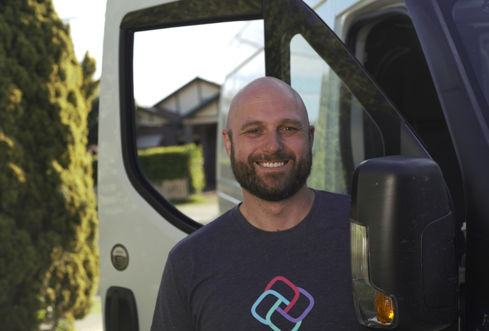
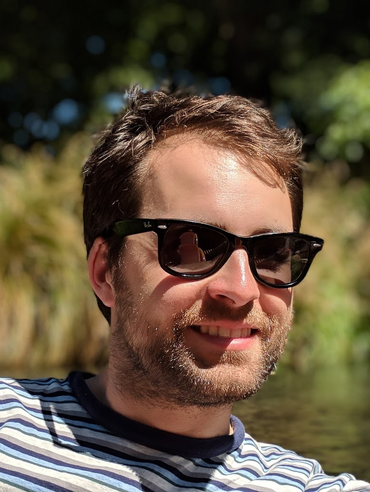

Title: About
BreadcrumbTitle: About
Xref: About
---

We are a team of security researchers, open-source software engineers, community managers and privacy specialists that support the concept of technology-based contact tracing.

* We want to see lives saved through the use of this technology.
* It is crucial to us that privacy and security issues are addressed promptly and communicated in an inclusive and open manner.
* We believe transparency is essential to achieve both of these goals without compromising either. Compromising privacy risks people’s lives by undermining public trust in the systems built to protect them.
* This can only be achieved by direct collaboration with engineers using transparent open source platforms such as the UK National Health Service.

<?# Twitter 1258453749691027465 /?>

# Geoffrey Huntley

🙌 I'm Geoff, the probono open-source software engineer leading the independent analysis of <a href="https://covidsafe.gov.au/">covidsafe</a> via studying the source code. Software that I maintain is inside Microsoft Visual Studio, GitHub, Atlassian Sourcetree, Amazon Drive, Halo, Slack, is heavily used by the financial services industry and has been installed by other software developers over 21 million times.

<a href="https://twitter.com/geoffreyhuntley">Follow me on Twitter</a> for latest updates and findings or support my efforts for government transparency by <a href="https://ghuntley.com/support">buying me a cup of coffee</a>.

Photo licensed under Attribution 4.0 International (CC BY 4.0)

# Jim Mussared

I'm a hybrid hardware and software developer, with current professional experience with open-source development and designing/developing BLE-based products for <a href="https://georgerobotics.com/">George Robotics</a>. Formerly worked in programming/electronics education at Grok Learning, and before that at Google Australia as a tech lead in the SRE team as well as some time working with the Android team.

My <a href="https://docs.google.com/document/d/1u5a5ersKBH6eG362atALrzuXo3zuZ70qrGomWVEC27U/preview">Bluetooth research</a> into contact tracing has received world wide praise. I discovered a <a href="https://github.com/alwentiu/COVIDSafe-CVE-2020-12856">Bluetooth security vulrunability</a> (CVE-2020-12856) which requires governments to modify their technological approaches and programs of work.

Follow <a href="https://twitter.com/jim_mussared">me on Twitter</a> for the latest updates.

Photo licensed under Attribution 4.0 International (CC BY 4.0)

# Richard Nelson

I'm a professional software engineer of 16 years, 8 of which have been in mobile app development and leadership. I have a strong interest in infosec, and my <a href="https://docs.google.com/document/d/1sviVey1jCk97BACwkAJMctG8rFlC7Mf8pMpluW6VOQw/preview">research into the iPhone application background behaviour</a> identified a coding error as a contributing factor preventing COVIDSafe from working effectively. I discovered a <a href="/issue-register/cve-2020-12717-ios-bluetooth-denial-of-service">denial of service vulnerability</a> (CVE-2020–12717) in COVIDSafe.

Follow <a href="https://twitter.com/wabzqem">me on Twitter</a> for the latest updates.

Photo licensed under Attribution 4.0 International (CC BY 4.0)
