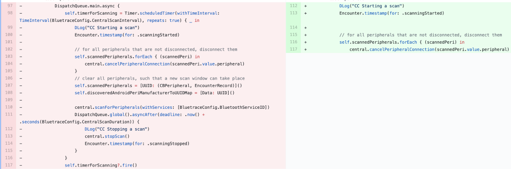
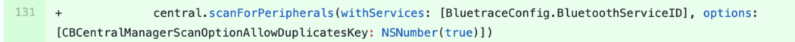

Title: Ineffectiveness of iPhones was primarily a bug caused by a  software developer
Status: Not submitted. Requires proof read and readability improvements.
IssueMaintainer: wabz 
---

# Overview

The ineffectiveness of COVIDSafe on iPhone was a bug in COVIDSafe, and not substantially a limitation imposed by Apple. A technical report was provided to the DTA before the Senate meeting. Whilst the problem has been resolved there has been no communication by DTA in this regard, because it contradicts the very public statements DTA made to the Senate and in the media as to the background behaviour on iOS being a limitation imposed by Apple.

# 23rd of April 2020

> Australia’s forthcoming contact tracing app will be fundamentally different to Singapore’s TraceTogether, with improvements having already been made to the latter's functionality.
>
> Acting health department secretary Caroline Edwards told a senate inquiry into COVID-19 on Thursday that although the app is derived from TraceTogether, its code base will be unique.
>
> "I don’t think the Singapore TraceTogether app is the model," she said in response to questions from Labor senator Murray Watt, adding that it has been an "important contributor"
> 
> But Australia’s app, which is being developed by the Digital Transformation Agency, is expected to build on TraceTogether elements, particularly around Bluetooth on iPhones.
>
> Edwards said that the DTA app would not need to constantly run in the foreground for contacts to be recorded, although he admitted Bluetooth would work better with the app open.

From: https://www.itnews.com.au/news/australias-covid-tracing-app-better-than-singapores-health-chief-547126

# 2nd of May 2020

Technical anaylsis of COVIDSafe for iPhone performed by Richard Nelson, that identifies human error and a line in the source code as the reason why iPhones are not working when in the background.

Below you will find the technical explanation of the bug observed in the COVIDSafe iOS application, causing it to be much less effective than it could be, while the application is not in the foreground.

See https://docs.google.com/document/d/1sviVey1jCk97BACwkAJMctG8rFlC7Mf8pMpluW6VOQw/preview for the original report which was shared with the DTA.


## Repeated scanning for peripherals (and not in the background)

> The below reproducible output shows evidence of the iOS application continually initiating scans in the foreground, and never initiating in the background. A Frida script hooks the CBCentralManager scanForPeripheralsWithServices method, and displays the first argument (the app’s service UUID) when run. When the application is in foreground state, the scan is run every minute. Once the app goes into the background, we don’t observe any scans, and stopScan has been called meaning the bluetooth central manager will not send any more discovered peripherals in central mode. When it’s put in the foreground again, the scan runs again. Be sure to run this without other devices interfering. Timestamps are important, the app starts in the foreground. Important to note is that it’s not actually required in iOS to continue requesting a scan. This only needs to happen once, and iOS will call centralManager(_:didDiscover:advertisementData:rssi:) when a peripheral is discovered in future, with some limitations.


## Debug Breakpoints

> Further evidence can be seen by setting up a debugger on the COVIDSafe app. Using a disassembler, you can find the entry point of the delegate method: 

`centralManager(_:didDiscover:advertisementData:rssi:)`

> This delegate method tells the delegate the central manager discovered a peripheral while scanning for devices. In the COVIDSafe binary, this method is at address 0x100055c14. To set a breakpoint, you first need to calculate the ASLR offset. You can do this by using lldb to show where the COVIDSafe image is based. Here’s a video that shows the breakpoint correctly hitting once the second iOS device runs the scan (when the app is opened). This doesn’t show it not occurring (the above script does), but that would have been a very long video, as the breakpoint never occurs. This follows from the above evidence that scan results are not sent to the application.

## The Bug

> The COVIDSafe application code is derived from OpenTrace. In the OpenTrace source code, it sets up a timer to run here:

https://github.com/opentrace-community/opentrace-ios/blob/75fc506bef34ba48a727f9758f94823b9b4a2286/OpenTrace/Bluetrace/CentralController.swift#L86

> The main problem here is that it is continuously starting and stopping scans, using a timer. When the application is put into the background, the timer started on the main thread’s execution is paused, and scans do not run. When the application enters the foreground again, it runs immediately because the timer suddenly expires. It then may run again shortly after (as seen in the script output above).
>
> Calling stopScan ensures that peripherals discovered on future system scan results are not reported to the app.
>
> Based on the evidence of the behaviour above, we can readily believe that this bug (or a variant of) has been copied to the Australian COVIDSafe application.

## The Fix

> I believe the application only needs to call `scanForPeripherals once`. I have an example project which continues to get peripheral discovery callbacks when it is in the background. The key to this, apart from not continuously starting and stopping scans is to set `CBCentralManagerScanOptionAllowDuplicatesKey` to `true`, allowing multiple discoveries of the same peripheral. The behaviour of this changes in the background, but on system scans devices continue to be reported to the app (multiple times). Example output from the application is at the bottom of this document.

## Frida Trace with no other devices

> Frida-trace output of the COVIDSafe app showing timings, application going from foreground to background, stopScan being called, and then scan resuming in foreground. No other devices with the COVIDSafe app in the foreground were present.

```
           /* TID 0x2f0b */
  4256 ms  -[CBCentralManager stopScan]
  4256 ms     | -[CBCentralManager setIsScanning:0x0]
           /* TID 0x407 */
 53301 ms  -[CBCentralManager cancelPeripheralConnection:0x2806f9360]
 53301 ms     | -[CBCentralManager cancelPeripheralConnection:0x2806f9360 options:0x2831fab20]
 53302 ms  -[NSKVONotifying_CBCentralManager dealloc]
 53302 ms  -[CBCentralManager scanForPeripheralsWithServices:0x2839b6f40 options:0x0]
 53302 ms     | -[CBCentralManager setIsScanning:0x1]
           /* TID 0x3927 */
 53442 ms  -[CBCentralManager handleMsg:0x3c args:0x280ef5a40]
 53443 ms     | -[CBCentralManager handlePeripheralDiscovered:0x280ef5a40]
 53443 ms     |    | -[CBCentralManager peripheralWithInfo:0x280ef5a40]
 53443 ms     |    | -[CBCentralManager dataArrayToUUIDArray:0x2835fcdb0]
 53443 ms     |    | -[CBCentralManager delegate]
 53444 ms     |    | -[NSKVONotifying_CBCentralManager class]
 53444 ms     |    | -[NSKVONotifying_CBCentralManager setDelegate:0x281cfdff0]
 53444 ms     |    |    | -[NSKVONotifying_CBCentralManager class]
 53445 ms     |    | -[CBCentralManager connectPeripheral:0x2806f9360 options:0x0]
           /* TID 0x2f0b */
 53936 ms  -[CBCentralManager handleMsg:0x3d args:0x2819ccd80]
 53937 ms     | -[CBCentralManager handlePeripheralConnectionCompleted:0x2819ccd80]
 53937 ms     |    | -[CBCentralManager peripheralWithIdentifier:0x2831f8420]
 53937 ms     |    | -[CBCentralManager delegate]
 53937 ms     |    | -[NSKVONotifying_CBCentralManager setDelegate:0x281cfdff0]
 53937 ms     |    |    | -[NSKVONotifying_CBCentralManager class]
 54022 ms  -[CBCentralManager handleMsg:0x3e args:0x2822b7500]
 54022 ms     | -[CBCentralManager handlePeripheralCLReady:0x2822b7500]
 54022 ms     |    | -[CBCentralManager peripheralWithIdentifier:0x2831fa560]
 54023 ms  -[CBCentralManager handleMsg:0x5e args:0x2822b5380]
 54023 ms     | -[CBCentralManager peripheralWithIdentifier:0x2831f8420]
           /* TID 0x3927 */
 54682 ms  -[CBCentralManager handleMsg:0x6b args:0x2822b6bc0]
 54682 ms     | -[CBCentralManager peripheralWithIdentifier:0x2831f81e0]
 54742 ms  -[CBCentralManager handleMsg:0x73 args:0x2819ccd00]
 54742 ms     | -[CBCentralManager peripheralWithIdentifier:0x2831f8420]
           /* TID 0x2f0b */
 54836 ms  -[CBCentralManager handleMsg:0x79 args:0x2819d4880]
 54836 ms     | -[CBCentralManager peripheralWithIdentifier:0x2831fea00]
 54837 ms     | -[NSKVONotifying_CBCentralManager class]
 54837 ms     | -[NSKVONotifying_CBCentralManager class]
           /* TID 0x3927 */
 54922 ms  -[NSKVONotifying_CBCentralManager class]
 54922 ms  -[NSKVONotifying_CBCentralManager class]
 54922 ms  -[NSKVONotifying_CBCentralManager class]
           /* TID 0x2f0b */
 55011 ms  -[CBCentralManager handleMsg:0x7a args:0x2822b6dc0]
 55011 ms     | -[CBCentralManager peripheralWithIdentifier:0x2831f8420]
 55012 ms     | -[NSKVONotifying_CBCentralManager class]
 55012 ms     | -[CBCentralManager cancelPeripheralConnection:0x2806f9360]
 55012 ms     |    | -[CBCentralManager cancelPeripheralConnection:0x2806f9360 options:0x2831fd9e0]
           /* TID 0x3927 */
 55014 ms  -[CBCentralManager handleMsg:0x3f args:0x2822b6980]
 55014 ms     | -[CBCentralManager handlePeripheralDisconnectionCompleted:0x2822b6980]
 55015 ms     |    | -[CBCentralManager peripheralWithIdentifier:0x2831f81e0]
 55015 ms     |    | -[CBCentralManager delegate]
 55015 ms     |    | -[NSKVONotifying_CBCentralManager class]
 55102 ms  -[NSKVONotifying_CBCentralManager class]
 55102 ms  -[NSKVONotifying_CBCentralManager class]
 55102 ms  -[NSKVONotifying_CBCentralManager class]
 64255 ms  -[CBCentralManager stopScan]
 64260 ms     | -[CBCentralManager setIsScanning:0x0]
           /* TID 0x407 */
 71969 ms  -[UIApplication _applicationDidEnterBackground]
518229 ms  -[CBCentralManager cancelPeripheralConnection:0x2806f9360]
518229 ms     | -[CBCentralManager cancelPeripheralConnection:0x2806f9360 options:0x2831fa780]
518231 ms  -[NSKVONotifying_CBCentralManager dealloc]
518231 ms  -[CBCentralManager scanForPeripheralsWithServices:0x2839b5650 options:0x0]
518232 ms     | -[CBCentralManager setIsScanning:0x1]
518233 ms  -[UIApplication _sendWillEnterForegroundCallbacks]
```

## Frida Trace with other device scanning while in background

> Frida-trace output showing scanning events when in background and COVIDSafe is opened on another iPhone:

```
           /* TID 0xb13 */
  6347 ms  -[CBCentralManager stopScan]
  6348 ms     | -[CBCentralManager setIsScanning:0x0]
           /* TID 0x407 */
 55403 ms  -[CBCentralManager cancelPeripheralConnection:0x2828ac000]
 55404 ms     | -[CBCentralManager cancelPeripheralConnection:0x2828ac000 options:0x281fb01c0]
 55404 ms  -[NSKVONotifying_CBCentralManager dealloc]
 55404 ms  -[CBCentralManager scanForPeripheralsWithServices:0x2817fc1b0 options:0x0]
 55405 ms     | -[CBCentralManager setIsScanning:0x1]
           /* TID 0x666b */
 55460 ms  -[CBCentralManager handleMsg:0x3c args:0x28209c000]
 55460 ms     | -[CBCentralManager handlePeripheralDiscovered:0x28209c000]
 55460 ms     |    | -[CBCentralManager peripheralWithInfo:0x28209c000]
 55460 ms     |    | -[CBCentralManager dataArrayToUUIDArray:0x281b98030]
 55461 ms     |    | -[CBCentralManager delegate]
 55462 ms     |    | -[NSKVONotifying_CBCentralManager class]
 55462 ms     |    | -[NSKVONotifying_CBCentralManager setDelegate:0x283286fb0]
 55463 ms     |    |    | -[NSKVONotifying_CBCentralManager class]
 55463 ms     |    | -[CBCentralManager connectPeripheral:0x2828ac000 options:0x0]
           /* TID 0xb13 */
 56256 ms  -[CBCentralManager handleMsg:0x3d args:0x2837d4300]
 56256 ms     | -[CBCentralManager handlePeripheralConnectionCompleted:0x2837d4300]
 56257 ms     |    | -[CBCentralManager peripheralWithIdentifier:0x281fb0060]
 56257 ms     |    | -[CBCentralManager delegate]
 56257 ms     |    | -[NSKVONotifying_CBCentralManager setDelegate:0x283286fb0]
 56257 ms     |    |    | -[NSKVONotifying_CBCentralManager class]
 56343 ms  -[CBCentralManager handleMsg:0x3e args:0x280c08540]
 56343 ms     | -[CBCentralManager handlePeripheralCLReady:0x280c08540]
 56344 ms     |    | -[CBCentralManager peripheralWithIdentifier:0x281fb8200]
 56344 ms  -[CBCentralManager handleMsg:0x5e args:0x280c08380]
 56344 ms     | -[CBCentralManager peripheralWithIdentifier:0x281fb8060]
           /* TID 0x666b */
 57003 ms  -[CBCentralManager handleMsg:0x6b args:0x280c084c0]
 57003 ms     | -[CBCentralManager peripheralWithIdentifier:0x281fb8180]
           /* TID 0xb13 */
 57063 ms  -[CBCentralManager handleMsg:0x73 args:0x2837e4100]
 57064 ms     | -[CBCentralManager peripheralWithIdentifier:0x281fb8200]
           /* TID 0x666b */
 57128 ms  -[CBCentralManager handleMsg:0x79 args:0x2837d4300]
 57129 ms     | -[CBCentralManager peripheralWithIdentifier:0x281fb01e0]
 57130 ms     | -[NSKVONotifying_CBCentralManager class]
 57130 ms     | -[NSKVONotifying_CBCentralManager class]
           /* TID 0xb13 */
 57303 ms  -[CBCentralManager handleMsg:0x7a args:0x280c00100]
 57303 ms     | -[CBCentralManager peripheralWithIdentifier:0x281fb0080]
 57303 ms     | -[NSKVONotifying_CBCentralManager class]
 57303 ms     | -[CBCentralManager cancelPeripheralConnection:0x2828ac000]
 57304 ms     |    | -[CBCentralManager cancelPeripheralConnection:0x2828ac000 options:0x281fb0100]
           /* TID 0x666b */
 57305 ms  -[CBCentralManager handleMsg:0x3f args:0x280c00100]
 57305 ms     | -[CBCentralManager handlePeripheralDisconnectionCompleted:0x280c00100]
 57305 ms     |    | -[CBCentralManager peripheralWithIdentifier:0x281fb01e0]
 57305 ms     |    | -[CBCentralManager delegate]
 57305 ms     |    | -[NSKVONotifying_CBCentralManager class]
 64532 ms  -[CBCentralManager handleMsg:0x3c args:0x2837d4280]
 64532 ms     | -[CBCentralManager handlePeripheralDiscovered:0x2837d4280]
 64532 ms     |    | -[CBCentralManager peripheralWithInfo:0x2837d4280]
 64533 ms     |    | -[CBCentralManager dataArrayToUUIDArray:0x281b98020]
 64533 ms     |    | -[CBCentralManager delegate]
 64534 ms     |    | -[NSKVONotifying_CBCentralManager class]
 64534 ms     |    | -[NSKVONotifying_CBCentralManager setDelegate:0x283286fb0]
 64534 ms     |    |    | -[NSKVONotifying_CBCentralManager class]
 64540 ms     |    | -[CBCentralManager connectPeripheral:0x282890000 options:0x0]
           /* TID 0xb13 */
 66347 ms  -[CBCentralManager stopScan]
 66347 ms     | -[CBCentralManager setIsScanning:0x0]
           /* TID 0x407 */
 73904 ms  -[UIApplication _applicationDidEnterBackground]
``` 

> At this point, I opened COVIDSafe on another iPhone. Note we are still in the background:

``` 
247596 ms  -[CBCentralManager cancelPeripheralConnection:0x2828ac000]
247608 ms     | -[CBCentralManager cancelPeripheralConnection:0x2828ac000 options:0x281fb8100]
           /* TID 0xb13 */
247609 ms  -[NSKVONotifying_CBCentralManager class]
247610 ms  -[NSKVONotifying_CBCentralManager class]
247610 ms  -[NSKVONotifying_CBCentralManager class]
           /* TID 0x407 */
247610 ms  -[CBCentralManager cancelPeripheralConnection:0x282890000]
247610 ms     | -[CBCentralManager cancelPeripheralConnection:0x282890000 options:0x281fb89c0]
247611 ms  -[NSKVONotifying_CBCentralManager dealloc]
247611 ms  -[NSKVONotifying_CBCentralManager dealloc]
247611 ms     | -[CBCentralManager cancelPeripheralConnection:0x282890000]
247611 ms     |    | -[CBCentralManager cancelPeripheralConnection:0x282890000 options:0x281fb80e0]
247611 ms  -[CBCentralManager scanForPeripheralsWithServices:0x281704510 options:0x0]
247611 ms     | -[CBCentralManager setIsScanning:0x1]
           /* TID 0x666b */
247619 ms  -[CBCentralManager handleMsg:0x3f args:0x280c09040]
247619 ms     | -[CBCentralManager handlePeripheralDisconnectionCompleted:0x280c09040]
247619 ms     |    | -[CBCentralManager peripheralWithIdentifier:0x281fb8220]
           /* TID 0x6e1f */
247708 ms  -[CBCentralManager handleMsg:0x3c args:0x28209c0e0]
247708 ms     | -[CBCentralManager handlePeripheralDiscovered:0x28209c0e0]
247708 ms     |    | -[CBCentralManager peripheralWithInfo:0x28209c0e0]
247708 ms     |    | -[CBCentralManager dataArrayToUUIDArray:0x281b982f0]
247708 ms     |    | -[CBCentralManager dataArrayToUUIDArray:0x281b982e0]
247709 ms     |    | -[CBCentralManager delegate]
247710 ms     |    | -[NSKVONotifying_CBCentralManager class]
247710 ms     |    | -[NSKVONotifying_CBCentralManager setDelegate:0x283286fb0]
247710 ms     |    |    | -[NSKVONotifying_CBCentralManager class]
247710 ms     |    | -[CBCentralManager connectPeripheral:0x2828ac000 options:0x0]
247712 ms  -[CBCentralManager handleMsg:0x3d args:0x2837d4380]
247713 ms     | -[CBCentralManager handlePeripheralConnectionCompleted:0x2837d4380]
247713 ms     |    | -[CBCentralManager peripheralWithIdentifier:0x281fb0120]
247713 ms     |    | -[CBCentralManager delegate]
247713 ms     |    | -[NSKVONotifying_CBCentralManager setDelegate:0x283286fb0]
247713 ms     |    |    | -[NSKVONotifying_CBCentralManager class]
247721 ms  -[CBCentralManager handleMsg:0x6b args:0x280c08f80]
247721 ms     | -[CBCentralManager peripheralWithIdentifier:0x281fb8180]
247771 ms  -[CBCentralManager handleMsg:0x73 args:0x2837e4800]
247771 ms     | -[CBCentralManager peripheralWithIdentifier:0x281fb80c0]
247801 ms  -[NSKVONotifying_CBCentralManager class]
247801 ms  -[NSKVONotifying_CBCentralManager class]
247801 ms  -[NSKVONotifying_CBCentralManager class]
247836 ms  -[CBCentralManager handleMsg:0x79 args:0x2837d4380]
247836 ms     | -[CBCentralManager peripheralWithIdentifier:0x281fb05a0]
247837 ms     | -[NSKVONotifying_CBCentralManager class]
247837 ms     | -[NSKVONotifying_CBCentralManager class]
248010 ms  -[CBCentralManager handleMsg:0x7a args:0x280c08380]
248011 ms     | -[CBCentralManager peripheralWithIdentifier:0x281fb8100]
248011 ms     | -[NSKVONotifying_CBCentralManager class]
248011 ms     | -[CBCentralManager cancelPeripheralConnection:0x2828ac000]
248012 ms     |    | -[CBCentralManager cancelPeripheralConnection:0x2828ac000 options:0x281fb80a0]
248013 ms  -[CBCentralManager handleMsg:0x3f args:0x280c01480]
248013 ms     | -[CBCentralManager handlePeripheralDisconnectionCompleted:0x280c01480]
248013 ms     |    | -[CBCentralManager peripheralWithIdentifier:0x281fb0940]
248013 ms     |    | -[CBCentralManager delegate]
248013 ms     |    | -[NSKVONotifying_CBCentralManager class]
```

> Application comes into foreground here, approx 2 mins later.


```
           /* TID 0x407 */
269145 ms  -[UIApplication _sendWillEnterForegroundCallbacks]
           /* TID 0x666b */
269149 ms  -[CBCentralManager stopScan]
269149 ms     | -[CBCentralManager setIsScanning:0x0]
```

> Output from the example application. Note the continuous discovery after being put into the background.

```
2020-05-02 20:08:39 +0000: Entering foreground...
Powered on
2020-05-02 20:08:39 +0000: Starting scan
Peripheral advertising..
2020-05-02 20:08:39 +0000: iPhone 13BA973A-A886-EDF6-EDD7-733AF21D77FC RSSI: -74
2020-05-02 20:08:39 +0000: iPhone 13BA973A-A886-EDF6-EDD7-733AF21D77FC RSSI: -74
2020-05-02 20:08:39 +0000: iPhone 13BA973A-A886-EDF6-EDD7-733AF21D77FC RSSI: -72
2020-05-02 20:08:39 +0000: iPhone 13BA973A-A886-EDF6-EDD7-733AF21D77FC RSSI: -72
2020-05-02 20:08:39 +0000: iPhone 13BA973A-A886-EDF6-EDD7-733AF21D77FC RSSI: -72
2020-05-02 20:08:39 +0000: iPhone 13BA973A-A886-EDF6-EDD7-733AF21D77FC RSSI: -72
2020-05-02 20:08:40 +0000: iPhone 13BA973A-A886-EDF6-EDD7-733AF21D77FC RSSI: -74
2020-05-02 20:08:40 +0000: iPhone 13BA973A-A886-EDF6-EDD7-733AF21D77FC RSSI: -74
2020-05-02 20:08:40 +0000: iPhone 13BA973A-A886-EDF6-EDD7-733AF21D77FC RSSI: -72
2020-05-02 20:08:40 +0000: iPhone 13BA973A-A886-EDF6-EDD7-733AF21D77FC RSSI: -72
2020-05-02 20:08:40 +0000: iPhone 13BA973A-A886-EDF6-EDD7-733AF21D77FC RSSI: -75
2020-05-02 20:08:40 +0000: iPhone 13BA973A-A886-EDF6-EDD7-733AF21D77FC RSSI: -74
2020-05-02 20:08:40 +0000: iPhone 13BA973A-A886-EDF6-EDD7-733AF21D77FC RSSI: -74
2020-05-02 20:08:40 +0000: iPhone 13BA973A-A886-EDF6-EDD7-733AF21D77FC RSSI: -74
2020-05-02 20:08:40 +0000: iPhone 13BA973A-A886-EDF6-EDD7-733AF21D77FC RSSI: -72
2020-05-02 20:08:41 +0000: iPhone C7DED3F8-1E49-640A-839A-496DDCF5EC80 RSSI: -96
2020-05-02 20:08:41 +0000: iPhone C7DED3F8-1E49-640A-839A-496DDCF5EC80 RSSI: -96
2020-05-02 20:08:41 +0000: iPhone 13BA973A-A886-EDF6-EDD7-733AF21D77FC RSSI: -74
2020-05-02 20:08:41 +0000: iPhone 13BA973A-A886-EDF6-EDD7-733AF21D77FC RSSI: -74
2020-05-02 20:08:41 +0000: iPhone 13BA973A-A886-EDF6-EDD7-733AF21D77FC RSSI: -72
2020-05-02 20:08:41 +0000: iPhone 13BA973A-A886-EDF6-EDD7-733AF21D77FC RSSI: -72
2020-05-02 20:08:41 +0000: iPhone 13BA973A-A886-EDF6-EDD7-733AF21D77FC RSSI: -67
2020-05-02 20:08:41 +0000: iPhone 13BA973A-A886-EDF6-EDD7-733AF21D77FC RSSI: -67
2020-05-02 20:08:41 +0000: iPhone 13BA973A-A886-EDF6-EDD7-733AF21D77FC RSSI: -72
2020-05-02 20:08:41 +0000: iPhone 13BA973A-A886-EDF6-EDD7-733AF21D77FC RSSI: -72
2020-05-02 20:08:41 +0000: iPhone 13BA973A-A886-EDF6-EDD7-733AF21D77FC RSSI: -68
2020-05-02 20:08:41 +0000: iPhone 13BA973A-A886-EDF6-EDD7-733AF21D77FC RSSI: -68
2020-05-02 20:08:42 +0000: iPhone 13BA973A-A886-EDF6-EDD7-733AF21D77FC RSSI: -77
2020-05-02 20:08:42 +0000: iPhone 13BA973A-A886-EDF6-EDD7-733AF21D77FC RSSI: -77
2020-05-02 20:08:42 +0000: iPhone 13BA973A-A886-EDF6-EDD7-733AF21D77FC RSSI: -72
2020-05-02 20:08:42 +0000: iPhone 13BA973A-A886-EDF6-EDD7-733AF21D77FC RSSI: -72
2020-05-02 20:08:42 +0000: iPhone 13BA973A-A886-EDF6-EDD7-733AF21D77FC RSSI: -67
2020-05-02 20:08:42 +0000: iPhone 13BA973A-A886-EDF6-EDD7-733AF21D77FC RSSI: -67
2020-05-02 20:08:43 +0000: iPhone 13BA973A-A886-EDF6-EDD7-733AF21D77FC RSSI: -74
2020-05-02 20:08:43 +0000: iPhone 13BA973A-A886-EDF6-EDD7-733AF21D77FC RSSI: -69
2020-05-02 20:08:43 +0000: iPhone 13BA973A-A886-EDF6-EDD7-733AF21D77FC RSSI: -69
2020-05-02 20:08:43 +0000: iPhone 13BA973A-A886-EDF6-EDD7-733AF21D77FC RSSI: -74
2020-05-02 20:08:43 +0000: iPhone 13BA973A-A886-EDF6-EDD7-733AF21D77FC RSSI: -74
2020-05-02 20:08:43 +0000: iPhone 13BA973A-A886-EDF6-EDD7-733AF21D77FC RSSI: -67
2020-05-02 20:08:43 +0000: iPhone 13BA973A-A886-EDF6-EDD7-733AF21D77FC RSSI: -67
2020-05-02 20:08:43 +0000: iPhone 13BA973A-A886-EDF6-EDD7-733AF21D77FC RSSI: -75
2020-05-02 20:08:43 +0000: iPhone 13BA973A-A886-EDF6-EDD7-733AF21D77FC RSSI: -74
2020-05-02 20:08:44 +0000: iPhone 13BA973A-A886-EDF6-EDD7-733AF21D77FC RSSI: -72
2020-05-02 20:08:44 +0000: iPhone 13BA973A-A886-EDF6-EDD7-733AF21D77FC RSSI: -72
2020-05-02 20:08:44 +0000: iPhone 13BA973A-A886-EDF6-EDD7-733AF21D77FC RSSI: -74
2020-05-02 20:08:44 +0000: iPhone 13BA973A-A886-EDF6-EDD7-733AF21D77FC RSSI: -74
2020-05-02 20:08:44 +0000: iPhone C7DED3F8-1E49-640A-839A-496DDCF5EC80 RSSI: -96
2020-05-02 20:08:44 +0000: iPhone C7DED3F8-1E49-640A-839A-496DDCF5EC80 RSSI: -95
2020-05-02 20:08:44 +0000: iPhone 13BA973A-A886-EDF6-EDD7-733AF21D77FC RSSI: -72
2020-05-02 20:08:44 +0000: iPhone 13BA973A-A886-EDF6-EDD7-733AF21D77FC RSSI: -73
2020-05-02 20:08:44 +0000: iPhone C7DED3F8-1E49-640A-839A-496DDCF5EC80 RSSI: -91
2020-05-02 20:08:44 +0000: iPhone C7DED3F8-1E49-640A-839A-496DDCF5EC80 RSSI: -91
2020-05-02 20:08:44 +0000: iPhone 13BA973A-A886-EDF6-EDD7-733AF21D77FC RSSI: -81
2020-05-02 20:08:44 +0000: iPhone 13BA973A-A886-EDF6-EDD7-733AF21D77FC RSSI: -79
2020-05-02 20:08:44 +0000: iPhone 13BA973A-A886-EDF6-EDD7-733AF21D77FC RSSI: -79
2020-05-02 20:08:45 +0000: iPhone 13BA973A-A886-EDF6-EDD7-733AF21D77FC RSSI: -68
2020-05-02 20:08:45 +0000: iPhone 13BA973A-A886-EDF6-EDD7-733AF21D77FC RSSI: -72
2020-05-02 20:08:45 +0000: iPhone 13BA973A-A886-EDF6-EDD7-733AF21D77FC RSSI: -72
2020-05-02 20:08:45 +0000: iPhone C7DED3F8-1E49-640A-839A-496DDCF5EC80 RSSI: -91
2020-05-02 20:08:45 +0000: iPhone 13BA973A-A886-EDF6-EDD7-733AF21D77FC RSSI: -73
2020-05-02 20:08:45 +0000: iPhone 13BA973A-A886-EDF6-EDD7-733AF21D77FC RSSI: -72
2020-05-02 20:08:45 +0000: iPhone C7DED3F8-1E49-640A-839A-496DDCF5EC80 RSSI: -93
2020-05-02 20:08:45 +0000: iPhone C7DED3F8-1E49-640A-839A-496DDCF5EC80 RSSI: -94
2020-05-02 20:08:45 +0000: iPhone 13BA973A-A886-EDF6-EDD7-733AF21D77FC RSSI: -78
2020-05-02 20:08:45 +0000: iPhone 13BA973A-A886-EDF6-EDD7-733AF21D77FC RSSI: -78
2020-05-02 20:08:45 +0000: iPhone C7DED3F8-1E49-640A-839A-496DDCF5EC80 RSSI: -91
2020-05-02 20:08:46 +0000: iPhone 13BA973A-A886-EDF6-EDD7-733AF21D77FC RSSI: -72
2020-05-02 20:08:46 +0000: iPhone 13BA973A-A886-EDF6-EDD7-733AF21D77FC RSSI: -72
2020-05-02 20:08:46 +0000: iPhone C7DED3F8-1E49-640A-839A-496DDCF5EC80 RSSI: -93
2020-05-02 20:08:46 +0000: iPhone 13BA973A-A886-EDF6-EDD7-733AF21D77FC RSSI: -74
2020-05-02 20:08:46 +0000: iPhone 13BA973A-A886-EDF6-EDD7-733AF21D77FC RSSI: -74
2020-05-02 20:08:46 +0000: iPhone C7DED3F8-1E49-640A-839A-496DDCF5EC80 RSSI: -88
2020-05-02 20:08:46 +0000: iPhone C7DED3F8-1E49-640A-839A-496DDCF5EC80 RSSI: -88
2020-05-02 20:08:46 +0000: iPhone 13BA973A-A886-EDF6-EDD7-733AF21D77FC RSSI: -72
2020-05-02 20:08:46 +0000: iPhone 13BA973A-A886-EDF6-EDD7-733AF21D77FC RSSI: -72
2020-05-02 20:08:46 +0000: iPhone C7DED3F8-1E49-640A-839A-496DDCF5EC80 RSSI: -91
2020-05-02 20:08:46 +0000: iPhone C7DED3F8-1E49-640A-839A-496DDCF5EC80 RSSI: -91
2020-05-02 20:08:47 +0000: Entering background...
2020-05-02 20:08:47 +0000: iPhone C7DED3F8-1E49-640A-839A-496DDCF5EC80 RSSI: -94
2020-05-02 20:08:47 +0000: iPhone C7DED3F8-1E49-640A-839A-496DDCF5EC80 RSSI: -94
2020-05-02 20:08:47 +0000: iPhone C7DED3F8-1E49-640A-839A-496DDCF5EC80 RSSI: -91
2020-05-02 20:08:47 +0000: iPhone 13BA973A-A886-EDF6-EDD7-733AF21D77FC RSSI: -70
2020-05-02 20:09:09 +0000: iPhone C7DED3F8-1E49-640A-839A-496DDCF5EC80 RSSI: -92
2020-05-02 20:09:09 +0000: iPhone C7DED3F8-1E49-640A-839A-496DDCF5EC80 RSSI: -92
2020-05-02 20:09:10 +0000: iPhone 13BA973A-A886-EDF6-EDD7-733AF21D77FC RSSI: -75
2020-05-02 20:09:10 +0000: iPhone 13BA973A-A886-EDF6-EDD7-733AF21D77FC RSSI: -75
2020-05-02 20:09:10 +0000: iPhone C7DED3F8-1E49-640A-839A-496DDCF5EC80 RSSI: -93
2020-05-02 20:09:10 +0000: iPhone C7DED3F8-1E49-640A-839A-496DDCF5EC80 RSSI: -93
2020-05-02 20:09:10 +0000: iPhone C7DED3F8-1E49-640A-839A-496DDCF5EC80 RSSI: -91
2020-05-02 20:09:10 +0000: iPhone C7DED3F8-1E49-640A-839A-496DDCF5EC80 RSSI: -91
2020-05-02 20:09:49 +0000: iPhone C7DED3F8-1E49-640A-839A-496DDCF5EC80 RSSI: -93
2020-05-02 20:09:49 +0000: iPhone C7DED3F8-1E49-640A-839A-496DDCF5EC80 RSSI: -93
2020-05-02 20:09:49 +0000: iPhone C7DED3F8-1E49-640A-839A-496DDCF5EC80 RSSI: -91
2020-05-02 20:09:49 +0000: iPhone C7DED3F8-1E49-640A-839A-496DDCF5EC80 RSSI: -92
2020-05-02 20:09:49 +0000: iPhone 13BA973A-A886-EDF6-EDD7-733AF21D77FC RSSI: -74
2020-05-02 20:09:49 +0000: iPhone 13BA973A-A886-EDF6-EDD7-733AF21D77FC RSSI: -74
2020-05-02 20:09:49 +0000: iPhone 13BA973A-A886-EDF6-EDD7-733AF21D77FC RSSI: -78
2020-05-02 20:09:49 +0000: iPhone 13BA973A-A886-EDF6-EDD7-733AF21D77FC RSSI: -78
2020-05-02 20:09:49 +0000: iPhone C7DED3F8-1E49-640A-839A-496DDCF5EC80 RSSI: -94
2020-05-02 20:09:49 +0000: iPhone 13BA973A-A886-EDF6-EDD7-733AF21D77FC RSSI: -68
2020-05-02 20:09:49 +0000: iPhone 13BA973A-A886-EDF6-EDD7-733AF21D77FC RSSI: -68
2020-05-02 20:10:36 +0000: iPhone 13BA973A-A886-EDF6-EDD7-733AF21D77FC RSSI: -73
2020-05-02 20:10:36 +0000: iPhone 13BA973A-A886-EDF6-EDD7-733AF21D77FC RSSI: -74
2020-05-02 20:10:36 +0000: iPhone 13BA973A-A886-EDF6-EDD7-733AF21D77FC RSSI: -71
2020-05-02 20:10:36 +0000: iPhone 13BA973A-A886-EDF6-EDD7-733AF21D77FC RSSI: -71
2020-05-02 20:10:36 +0000: iPhone C7DED3F8-1E49-640A-839A-496DDCF5EC80 RSSI: -94
2020-05-02 20:10:36 +0000: iPhone C7DED3F8-1E49-640A-839A-496DDCF5EC80 RSSI: -95
2020-05-02 20:26:24 +0000: iPhone 13BA973A-A886-EDF6-EDD7-733AF21D77FC RSSI: -69
2020-05-02 20:26:24 +0000: iPhone 13BA973A-A886-EDF6-EDD7-733AF21D77FC RSSI: -69
2020-05-02 20:26:24 +0000: iPhone 13BA973A-A886-EDF6-EDD7-733AF21D77FC RSSI: -78
2020-05-02 20:26:24 +0000: iPhone 13BA973A-A886-EDF6-EDD7-733AF21D77FC RSSI: -78
2020-05-02 20:26:24 +0000: iPhone 13BA973A-A886-EDF6-EDD7-733AF21D77FC RSSI: -67
2020-05-02 20:26:24 +0000: iPhone 13BA973A-A886-EDF6-EDD7-733AF21D77FC RSSI: -67
```

# 3rd of May 2020

<?# Twitter 1256700163147436032 /?>

<?# TWitter 1256701737898917888 /?>

# 6th of May 2020

<?# Twitter 1257870387930525696 /?>
<?# Twitter 1257871022465802240 /?>

# 13th of May 2020

> The government has now released the source code of its contact tracing app, COVIDSafe, but a developer has noted he's hitting brick walls when it comes to reporting any bugs or flaws with the app.
>
> Gizmodo Australia has contacted the DTA to understand how its process works and if it’s working on fixing any of the flaws Mussared and the group of developers have pointed out.
> 
> "As continuously stated, the Government will continue to work with Apple and Google to look for any opportunities to enhance the performance of their Bluetooth functionality – something that is not exclusive to the COVIDSafe app," a DTA spokesperson said to Gizmodo Australia.
> 
> "The app performs better than many similar apps in other countries."

From: https://www.gizmodo.com.au/2020/05/covidsafe-bug-reporting-problems/

> Jim Mussared is one Australian developer who's been working on uncovering the app's flaws to ensure it's doing what it's meant to. For him, it's made one thing particularly clear — the DTA hasn't been easy to work with when it comes to disclosing bugs.
>
> "Seeing the source code allows us to do a direct comparison to the Singapore [TraceTogether] code," Mussared said to Gizmodo Australia over email.
>
> "One very clear result of this is that there were zero functional changes to the iOS BLE backgrounding behaviour (CentralController.swift). We know that the Singapore team knew that background-to-background iPhone didn't work, so any claims by the DTA that they 'fixed it' indicate that either they never actually tested [or] investigated it, or their testing methodology was flawed."

From: https://www.gizmodo.com.au/2020/05/covidsafe-bug-reporting-problems/

# 14th of May 2020

COVIDSafe v1.2 for iPhone released which largely fixed background behaviour by implementing the recommendations of Richard Nelson. No announcements or communication that the problem has been resolved. Information regarding the updates on both the App Store and Google Play were vague, simply stating:

- Push notifications are now optional
- Improvements to Bluetooth security and connectivity
- Accessibility enhancements
- Bug fixes

<?# Twitter 1262892094361722880 /?>


# 15th of May 2020

> The source code for COVIDSafe version 1.2 has been posted, and it contains two very important updates:
>
> - A fix for background scanning on iOS devices
> - The security crash fix
>
> Number 2. is uninteresting, but 1. deserves attention.
>
> Even before COVIDSafe 1.0 was released, there was conflicting commentary on whether they had fixed the background iOS behaviour suffered by Singapore’s TraceTogether application. Apparently it was fixed, then maybe it wasn’t, then maybe it was slightly better?
> 
> Earlier in the month, before the source code was made available, I wrote up an analysis of the background behaviour of COVIDSafe, with a recommendation on how to improve the situation. We had the OpenTrace source code, but it was hard to tell if COVIDSafe had fixed anything as some politicians had suggested. I came to the conclusion that nothing had changed from OpenTrace, and that:
>
>> the application only needs to call scanForPeripherals once. I have an example project which continues to get peripheral discovery callbacks when it is in the background. The key to this, apart from not continuously starting and stopping scans is to set CBCentralManagerScanOptionAllowDuplicatesKey to true
>
> This is extremely important, but as confident as I was, I wasn’t 100% certain that the start/stop scans were being done for a reason I wasn’t privy to.
>
> Well, now we have the source code of version 1.2, and we can see exactly what they have <a href="https://github.com/AU-COVIDSafe/mobile-ios/commit/cae9823e4426af126b05d4680d49d19ab596db31#diff-ea5ac28399eeee2eeaf4c8ebfb03a7d4">changed here</a>: 
>
> 
>
> First, there’s no more timer that starts and stops scans. Second, there is no mention of `central.stopScan()` anywhere at all in the new code! And then:
>
> 
>
>
> They scan with `CBCentralManagerScanOptionAllowDuplicatesKey`.
> 
> This is good progress for COVIDSafe, and it completely validates the conclusion that I came to in my initial analysis.
> 
> However, <b>this very important change has been made rather silently, as it contradicts the very public statements DTA have made [to the Senate and in the media]  as to the background behaviour on iOS being a limitation imposed by Apple, and not an error in the way the application was using CoreBluetooth</b>.
> 
> iOS still has some background limitations, particularly that I have observed when the device is locked and unused. It will scan, but intervals can vary greatly. I (and others) noticed that simply waking the screen is often enough to trigger a bluetooth central scan to be made. It’s not clear to me if the next version of iOS will improve things here for applications not using their contact tracing methodology.
But for now, it’s unquestionable that COVIDSafe will perform in a much better manner in the background, without Apple’s assistance.

From: https://medium.com/@wabz/the-unbroken-ios-covidsafe-application-dea520af3694

# 18th of May 2020

<?# Twitter 1262535052040142849 /?>

> The update fixed a vulnerability that could have allowed for tracking of the unique identifiers through the app, software developer Jim Mussared said, and also removed the potential for denial of service attack and also greatly improved the functionality of the app while running in the background on iPhones.
>
> There have been muddled and contradictory messages from the government and DTA over COVIDSafe’s performance on iPhones and effectiveness when not running in the foreground. The update has gone a long way towards fixing these issues, Mr Mussared said.
> 
> "I’m almost disappointed for the DTA that they can’t get out there and scream from the rooftops because unfortunately they said it was never broken," he said.
> 
> "There has to be some admission of the way they addressed serious security issues, and it would be really wonderful if they could say they fixed the iPhone. Now it works as well as they said it used to.
> 
> "That’s important because people are not installing the app because they think it doesn’t work and they haven’t told people it has been fixed."
> 
> The government’s attention and public communications have still been focused on trying to convince more Australians to download the COVIDSafe app, with restrictions easing around the country.
> 
> But there needed to be more focus on ensuring everyone who has already downloaded it to proactively update the app if they do not have these turned on automatically, shadow assistant minister for cybersecurity Tim Watts said.
> 
> "An important update to the COVIDSafe iPhone app was released today improving both the security and the ability of the app to register contacts," Mr Watts said.
> 
> "While the PM regularly urges people to download the app he’s said nothing about the need for people to update this app," he said.

From: https://www.innovationaus.com/covidsafe-app-gets-important-update/

# 20th of May 2020

<?# Twitter 1262693741887807488 /?>

<!-- <# YouTube YKC78xdtt4E -->

<iframe width="709" height="399" src="https://www.youtube.com/embed/YKC78xdtt4E" frameborder="0" allow="accelerometer; autoplay; encrypted-media; gyroscope; picture-in-picture" allowfullscreen></iframe>

# 24th of May 2020

> Early on developers noted the iPhone version would not be able to exchange Bluetooth handshakes with other devices unless it was running on the screen – incredibly impractical for users.
> 
> The government initially denied this, refused to answer questions about it, and only once, before the Covid-19 senate committee, did the agency's chief executive, Randall Brugeaud, admit the Bluetooth function suffered when the app wasn’t on screen.
> 
> "What we can say is the quality of the Bluetooth connectivity for phones that have the app installed running in the foreground is very good," he said. "And it progressively deteriorates and the quality of the connection is not as good as you get to a point where the phone is locked and the app is running in the background."
> 
> That, in part, has been addressed by updates quietly released in the past week, but issues still persist, and will never truly be resolved unless the federal government implements functions released by Apple and Google this week.

From: https://www.theguardian.com/world/2020/may/24/how-did-the-covidsafe-app-go-from-being-vital-to-almost-irrelevant
