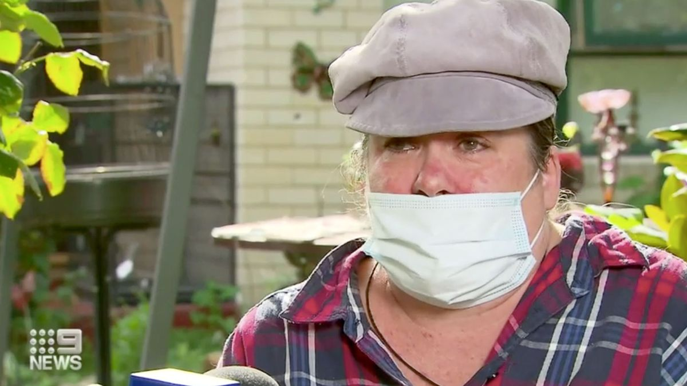
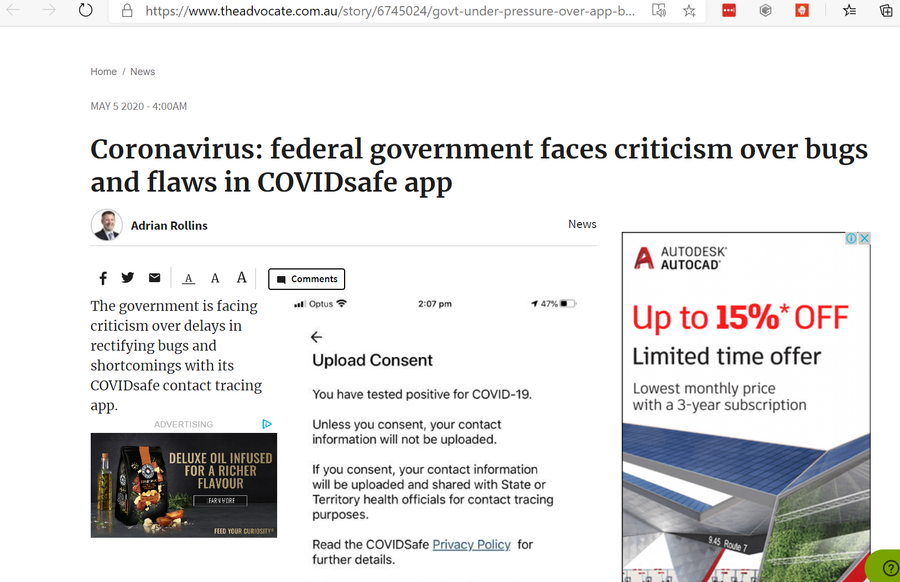

Title: Slow response to public panic
Status: Not submitted. Requires proof read and readability improvements.
IssueMaintainer: ghuntley
---

# April 27th, 2020 - Initial Discovery

Geoffrey Huntley documented the possibility of the language used in the application as an issue in his [COVIDSafe application dissection](https://docs.google.com/document/d/17GuApb1fG3Bn0_DVgDQgrtnd_QO3foBl7NVb8vaWeKc/edit#). 

> When a user taps the “upload my data” button the next screen asserts “You have tested positive for COVID-19” which may be a false assertion and cause confusion. This text needs changing.

This research featured on the front page of the technology website "Hacker News" and thus received wide attention from the global technology industry, including from Mike Cannon-Brookes, co-founder of Atlassian. 

https://news.ycombinator.com/item?id=22986147

> I believe the government, PM and various ministers have said the code will be released. My sources also say exactly the same. They’re obviously operating with extreme urgency to get the app out. For you. [... snip ...]

Mike Cannon-Brookes' account was created on the 1st of April 2020. The above comment is his first and only comment on this [very important] technology website. Mike's comments were picked up and widely circulated in the media.

https://www.smartcompany.com.au/coronavirus/angry-mob-cannon-brookes-covidsafe-app/

Whilst Geoffrey Huntley has no evidence that the Digital Transformation Agency read the application dissection document on the 27th. Mike's comments in the media and COVIDSafe being on the front page of this technology website would have have most likely resulted in one or more people within the Digital Transformation Agency monitoring the document which was continually updated for weeks.

<?# Twitter 1255671317145108482 /?>

# April 28th, 2020 - Public Panic

https://www.9news.com.au/national/covidsafe-app-melbourne-woman-feared-coronavirus-after-confusing-message/e9146501-6bbd-4509-b89a-406b2b98ed2a:

> A Melbourne woman feared she had coronavirus after confusing app message. Mother-of-two Holly Donovan from Frankston panicked when she thought the app had diagnosed her with coronavirus.
> 
> The message "You have tested positive for COVID-19" appeared when she tapped the button "has a health official asked you to upload your data?".

> It is not meant to tell users they have coronavirus, but instead ask them to confirm they have tested positive.
>
> "I got a shock and then I thought people should know about this, because some people would get really panicky and go oh god I've got it," Holly Donovan told 9News.

# April 30th, 2020 - Australian Financial Review

https://www.afr.com/politics/federal/tech-community-backs-covidsafe-app-20200430-p54olb

<!-- 

-->

> Over 500 met on Wednesday evening by video, after multiple developers and software engineers had reverse-engineered the code base and inspected it for security, integrity and usability.

<?# YouTube U3dN99ljgD4 /?>

> Led by Queensland open-source software engineer Geoff Huntley, a group of developers and programmers have collated the findings of about a dozen different efforts to review the code and the usability of the app
>
> Mr Huntley told the meeting the group was ready to share their findings with the government's developers to help debug and improve its usability.
>
> The group met up after Atlassian co-founder Mike Cannon-Brookes called on developers and software engineers to help debug the application.
>
> Mr Huntley detailed the issues the group had identified with the app.
>
> These included problems trying to register using Wi-Fi only; the lack of an alternative for SMS authentication – especially in remote areas with poor or no mobile service; and the need to have the app available on international platforms so people who are not on the Australian stores can access.
>
> Also noted was the need to be able to register international phone numbers for visitors who are using international SIM cards.
>
> The app uses bluetooth wireless signals to recognise another COVIDSafe app. There have also been issues of conflicts with other bluetooth applications, such as diabetes apps.
>
> There has also been confusion with a user exploring the app and getting a screen that says "you have tested positive". The screen came up after the user pressed the button used to upload data, after a person has been diagnosed with the virus.

# May 4th, 2020 - The Australian

https://www.news.com.au/national/breaking-news/virus-app-issues-stop-people-signing-up/news-story/da84a6643061dd7919c89d7910f39243

<!--

-->

> Mr Huntley also points out that anyone checking out all the areas of the app will easily end up on a page with the first line of text: "You have tested positive for COVID-19."
> 
> "It has caused public panic and it can still cause public panic," he said.
> 
> But he says multiple attempts to contact government agencies to report issues went unacknowledged until he was interviewed in media on Monday morning.

# May 4th, 2020 - Software Update Released

COVIDSafe v1.0.15 was released which removed the text from the application. Time to resolution was 10 days.

# May 5th, 2020 - The Advocate

https://www.theadvocate.com.au/story/6745024/govt-under-pressure-over-app-bugs-and-flaws/?cs=12

<!-- 

-->

> Computer experts have voiced concern that, more than a week after the app was launched, the government was yet to issue a software update or address problems people have encountered in downloading and using the app.
> 
> In addition to well-known problems in making the app work effectively on Apple iphones, users have also encountered issues downloading the app, registering for use and obtaining technical support.
> 
> Software engineer Geoffrey Huntley said one of the potentially most alarming yet easily rectified problems was that the app displayed the message "You have tested positive for COVID-19" when users pressed the 'Upload my information' button at the bottom of the main page.
>
> The issue came to public attention within days of the app's launch when a Melbourne woman described her panic after coming across the message.
> 
> Mr Huntley said it would be simple to change the wording on the app to fix the problem and was concerned that an update was yet to be rolled out.
> 
> He said there were a number of problems with user experience that were yet to be addressed, including blocked access to the app for people with offshore iTunes accounts, the necessity of having an Australian mobile number and the requirement that users have access to SMS in order to register.
> 
> Mr Huntley said there was "no customer support" addressing these or other issues raised by users and those attempting to download the app and register for its use.
> 
> "The government keeps talking about the number of downloads. That should not be the success metric. The metric should be how it is working," he said.

# Closing Remarks and Recommendations

In Geoffrey Huntley's and Richard Nelson's professional opinion 10 days is unacceptable time to resolution as the fix involved removing a single line of text from the application and releasing a new version of the application.

Releasing a new version of the application should have been done immediately after seeing reports that mother-of-two Holly Donovan from Frankston panicked when she thought the app had diagnosed her with coronavirus.

New versions of mobile applications can be automatically released to the Google and Apple stores without human interaction. This is industry best practice - also known as continuous integration/continuous delivery. Geoffrey Huntley has taught these methods as lectures at Microsoft and as in-person training to companies within Australia.

<?# Twitter 795916731482980353 /?>
<?# Twitter 801069425323610113 /?>
<?# Twitter 875941345663139850 /?>
<?# Twitter 842263391121022976 /?>

This educational material has been available, free of charge since 2016 and can be obtained at:

- https://github.com/ghuntley/appstore-automation-with-fastlane
- https://www.youtube.com/watch?v=mF0QonkbuqU
- https://fastlane.tools/

